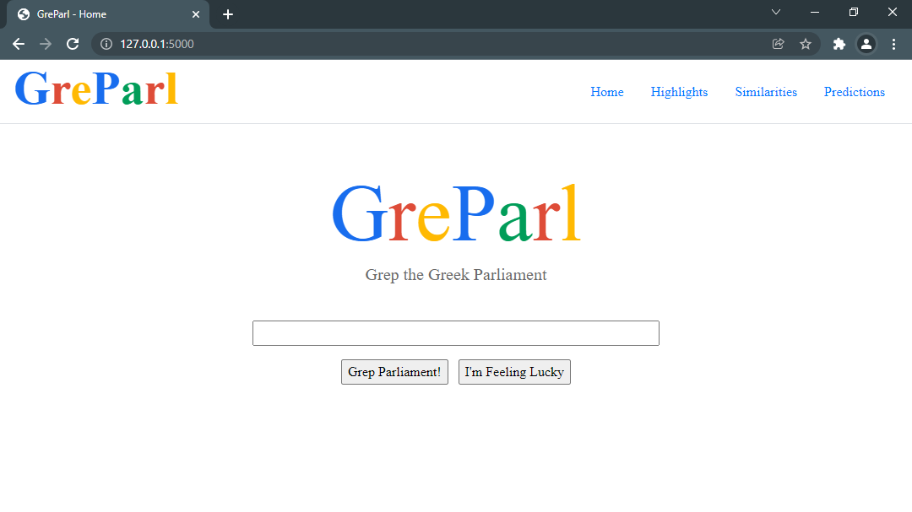

# GreParl
A simple web-app-based Search Engine built on top of the Greek Parliament Proceedings

## Name
grep + Greek Parliament

## Install
1. Run (ideally in a fresh venv) `pip install greparl`
1. Download the required data files and, if needed, decompress them in the desired directory (see below)

## Run
1. Activate venv
1. Run `greparl` and wait for signs of life..
1. The default browser should open up automatically, but if not, browse to "http://127.0.0.1:5000/" manually

## Data Files
The required data files that **are not shipped** along with the package include the Search Engine's indices, the parliament proceedings' file and some other tasty stuff.

- The raw proceedings can be downloaded here: [speeches.csv](https://aristotleuniversity-my.sharepoint.com/personal/papadopo_office365_auth_gr/_layouts/15/onedrive.aspx?id=%2Fpersonal%2Fpapadopo%5Foffice365%5Fauth%5Fgr%2FDocuments%2FGreek%5FParliament%5FProceedings%5F1989%5F2020%2Ezip&parent=%2Fpersonal%2Fpapadopo%5Foffice365%5Fauth%5Fgr%2FDocuments)
- The Search Engine's core can be downloaded here: [information-retrieval.tar.gz](https://aristotleuniversity-my.sharepoint.com/:u:/g/personal/grammenot_office365_auth_gr/EQEWl2-R7n9EnREy6VUDKesBFRaFfdMKeLiVIBblMMYKcA?e=wxaswN)

> Those files should be decompressed in the same directory from which the user will run the GreParl.

Alternatively, all required files (apart from `speeches.csv`) can be auto-generated.

## Important Notes
The author of this package is **not** the creator of Search Engine's core. All credits should go to [Theodoros Grammenos' work](https://github.com/teogramm/ir-proj-priv). This project is just a graphical wrapper, trying to make life easier :D

Also, note that this projects ships a modified version of alup's [greek_stemmer](https://github.com/alup/python_greek_stemmer), which is originally distributed under MIT License.
